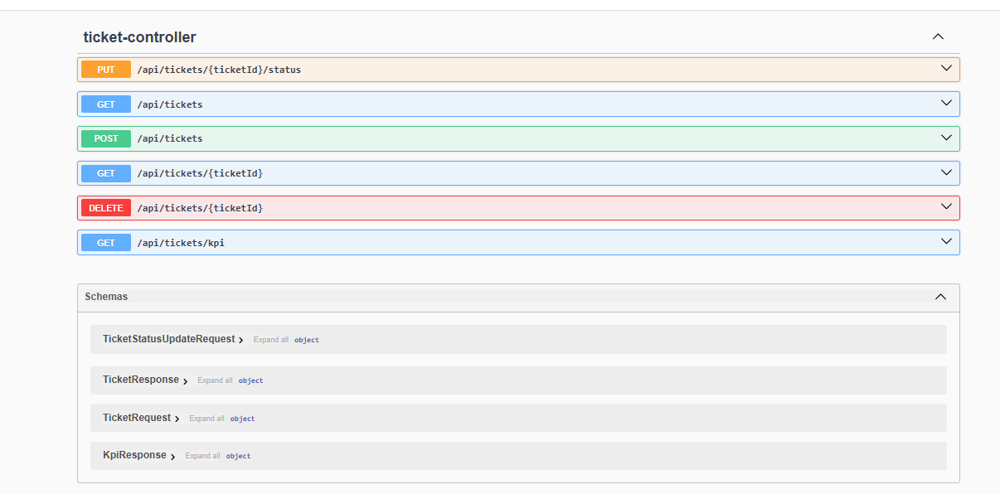
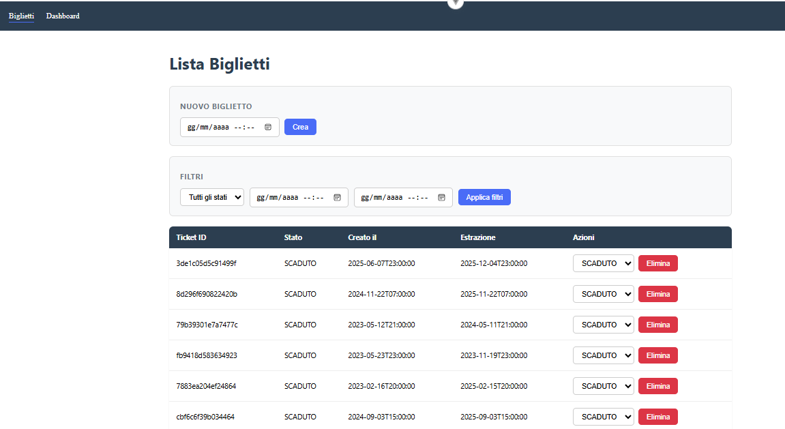
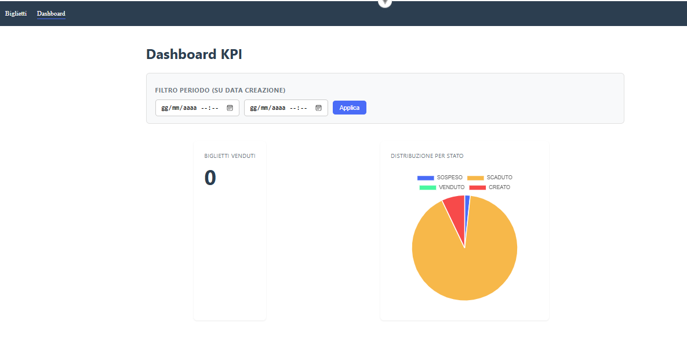

# Lottery Tickets — Gestione Biglietti Lotteria

Sistema di gestione biglietti della lotteria, sviluppato come prova tecnica.

## Stack Tecnologico

- **Backend**: Java 17, Spring Boot 3.4.2 (Web, Data JPA, Security, Validation)
- **Database**: MySQL 8.0
- **Frontend**: Vue 3 (Composition API) + Vite, Axios, Chart.js
- **Containerizzazione**: Docker / Docker Compose
- **Documentazione API**: Swagger / OpenAPI (springdoc)
- **Test**: JUnit 5, Mockito
- **CI**: GitHub Actions

## Struttura del progetto

```
lottery-tickets/
├── lottery-backend/       # API REST Spring Boot
├── lottery-frontend/      # Interfaccia Vue 3
├── docker-compose.yml
├── .env.example
├── README.md
└── DECISIONS.md
```

## Prerequisiti

- [Docker Desktop](https://www.docker.com/products/docker-desktop/) installato e avviato
- (Solo per sviluppo locale senza Docker) Java 17, Node.js 18+, MySQL 8

## Avvio rapido con Docker

1. Clona il repository:
```bash
git clone https://github.com/salvatoreadamo2023/lottery-tickets.git
cd lottery-tickets
```

2. Copia il file di esempio delle variabili d'ambiente:
```bash
# Linux / macOS
cp .env.example .env

# Windows (cmd)
copy .env.example .env
```

3. Avvia tutto lo stack (database, backend, frontend):
```bash
docker-compose up --build
```
   Al primo avvio: viene creato il database, le tabelle vengono generate automaticamente, e il dataset di esempio (`ticket_seed.xlsx`) viene importato automaticamente con pulizia dei dati sporchi (vedi DECISIONS.md per le regole adottate).

4. Servizi disponibili:
   - Backend API: `http://localhost:8080`
   - Frontend: `http://localhost:5173`
   - Database MySQL: `localhost:3306`

## Avvio in sviluppo locale (senza Docker, opzionale)

Utile per sviluppare/ispezionare il codice con hot-reload.

**Backend** (richiede MySQL locale attivo e variabili d'ambiente configurate nell'IDE — vedi sezione "Variabili d'ambiente"):
```bash
cd lottery-backend
mvn spring-boot:run
```

**Frontend**:
```bash
cd lottery-frontend
npm install
npm run dev
```
Disponibile su `http://localhost:5173`.

## Variabili d'ambiente

Le credenziali non sono mai hardcoded nel codice. Per l'esecuzione locale senza Docker, vanno impostate come variabili d'ambiente nell'IDE (es. Run Configuration di Eclipse/STS):

```
ADMIN_USERNAME=admin
ADMIN_PASSWORD=admin123
DB_USER=lottery_user
DB_PASSWORD=lottery_pass
DB_NAME=lottery_db
```

## Accesso e credenziali

L'API è protetta con Basic Auth. Credenziali di default (modificabili in `.env`):

- Username: `admin`
- Password: `admin123`

> Nota: queste sono credenziali dimostrative per l'ambiente locale di valutazione. In un contesto di produzione andrebbero gestite tramite un secret manager (es. AWS Secrets Manager) e mai esposte in chiaro nella documentazione.

## Documentazione API (Swagger)

```
http://localhost:8080/swagger-ui/index.html
```



## Funzionalità principali

- CRUD completo sui biglietti
- Generazione automatica di `privateCode` e `ticketId`
- Job schedulato che porta automaticamente a `SCADUTO` i biglietti con `extractAt` superata
- Regola di business: un biglietto `SCADUTO` non può cambiare stato (dettagli in DECISIONS.md)
- Dashboard KPI: numero biglietti venduti + distribuzione per stato, con filtro temporale
- Audit trail di tutte le operazioni sui biglietti
- Import dataset iniziale con gestione dati sporchi (duplicati, date incoerenti, stati non validi)

## Screenshot

| Lista Biglietti | Dashboard KPI |
|---|---|
|  |  |

## Test

Per eseguire i test del backend:
```bash
cd lottery-backend
mvn test
```

La pipeline CI (GitHub Actions) esegue automaticamente i test ad ogni push su `main`.

## Documentazione scelte progettuali

Le decisioni architetturali, i trade-off, l'interpretazione dei requisiti ambigui e le regole di pulizia del dataset sono descritte in [DECISIONS.md](./DECISIONS.md).
